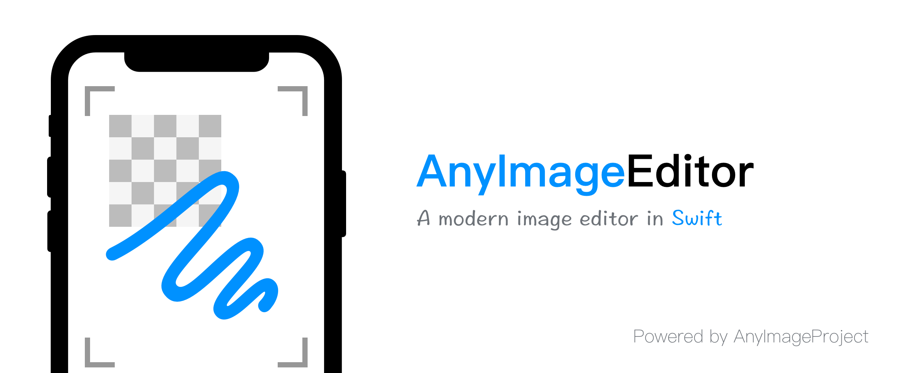

`AnyImageEditor` is an image editor which support for drawing, crop and mosaic. It's written in Swift. 

> [中文说明](./README_CN.md)

## Features

- [x] Draw
- [ ] Emoji
- [ ] Input text
- [x] Crop
- [x] Mosaic
- [ ] Multiple platform support
    - [x] iOS
    - [ ] iPadOS
    - [ ] Mac Catalyst
    - [ ] macOS
    - [ ] tvOS

## Requirements

- iOS 10.0+
- Xcode 11.0+
- Swift 5.0+

## Installation

### [CocoaPods](https://guides.cocoapods.org/using/using-cocoapods.html)

Add this to `Podfile`, and then update dependency:

```ruby
pod 'AnyImageEditor'
```

### [Carthage](https://github.com/Carthage/Carthage)

Add this to `Cartfile`, and then update dependency:

```ogdl
github "AnyImageProject/AnyImageEditor"
```

> Unsupport `--no-use-binaries`

## Usage

### Quick Start

```swift
import AnyImageEditor

let image = UIImage(named: "test-image")!
let controller = ImageEditorController(image: image, delegate: self)
controller.modalPresentationStyle = .fullScreen
present(controller, animated: true, completion: nil)

/// ImageEditorPhotoDelegate
func imageEditorDidFinishEdit(photo: UIImage) {
  // Your code
}
```

## License

AnyImageEditor is released under the MIT license. See [LICENSE](./LICENSE) for details.
