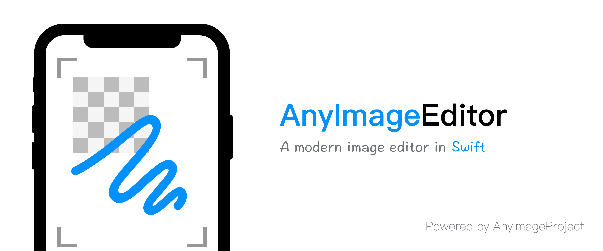

`AnyImageEditor` 已转移至 [AnyImageKit](https://github.com/AnyImageProject/AnyImageKit)。

`AnyImageEditor` 是一个图片编辑器，支持涂鸦、裁剪、马赛克。使用 Swift 编写。

## 功能

- [x] 涂鸦
- [ ] 表情
- [ ] 文字
- [x] 裁剪
- [x] 马赛克
- [ ] 多平台支持
    - [x] iOS
    - [ ] iPadOS
    - [ ] Mac Catalyst
    - [ ] macOS
    - [ ] tvOS

## 要求

- iOS 10.0+
- Xcode 11.0+
- Swift 5.0+

## 使用方法

### 快速上手

```swift
import AnyImageEditor

let image = UIImage(named: "test-image")!
let controller = ImageEditorController(image: image, delegate: self)
controller.modalPresentationStyle = .fullScreen
present(controller, animated: true, completion: nil)

/// ImageEditorPhotoDelegate
func imageEditorDidFinishEdit(photo: UIImage) {
  // Your code
}
```

## 版权协议

AnyImageEditor 基于 MIT 协议进行分发和使用，更多信息参见[协议文件](./LICENSE)。
